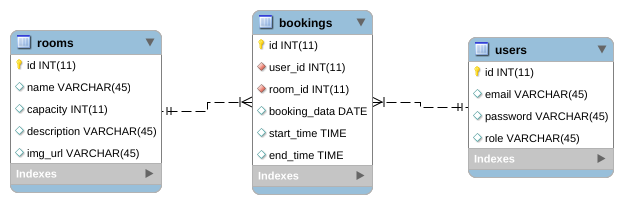

# 🏢 CoWork Space — Системное проектирование и планирование

Репозиторий содержит документацию, архитектурные наброски и план разработки информационной системы для бронирования рабочих пространств и переговорных комнат (**Coworking Booking App**).

---

## 📅 Этап 1: Командная работа и Аналитика (Понедельник)

### 👥 1. Распределение ролей в команде
*   **Backend Developer / DBA:** Проектирование базы данных MySQL, создание REST API на Express.js, настройка аутентификации (JWT, Bcrypt).
*   **Frontend Developer:** Разработка интерфейса на Nuxt 4 (Vue 3), интеграция Tailwind CSS, Shadcn Vue / Nuxt UI, работа со стейтом и валидацией (Zod).
*   **Project Manager / Analyst:** Определение требований, составление общего плана разработки, подготовка технической документации.

### 📝 2. Требования к системе (Функционал)
*   Безопасная регистрация пользователей и авторизация через сессионные JWT-токены.
*   Просмотр доступных коворкинг-зон и фильтрация комнат по вместимости.
*   Интерактивный календарь бронирования тайм-слотов в реальном времени.
*   Валидация пересечений времени (защита от двойного бронирования одной комнаты).
*   Полноценная административная панель со сквозной аналитикой и дашбордами.

---

## 👤 Роли пользователей

В системе разграничены права доступа на уровне бэкенд-мидлварей и фронтенд-роутинга:

| Роль | Права в системе |
| :--- | :--- |
| 🧑‍💻 **Пользователь (User)** | Регистрация/Вход, просмотр списка комнат, выбор даты и времени, создание бронирования, просмотр истории своих броней. |
| 👑 **Администратор (Admin)** | Все права пользователя + Доступ к админ-панели, добавление новых комнат, удаление комнат, просмотр общей аналитики платформы, отмена любого бронирования. |

---

## 🗺️ Список страниц и Спецификация API

### 🖥️ Интерфейс (Frontend Routes)
*   ` / ` — Главная страница (Поиск и список доступных комнат).
*   ` /auth/login ` & ` /auth/register ` — Страницы авторизации.
*   ` /my-bookings ` — Личный кабинет пользователя с его бронированиями.
*   ` /admin ` — Главный дашборд администратора (Статистика, графики загруженности).
*   ` /admin/rooms ` — Управление сущностями комнат (CRUD).
*   ` /admin/bookings ` — Лог всех бронирований в системе с возможностью отмены.

### 🔌 Эндпоинты бэкенда (REST API REST)
*   `POST /api/auth/register` — Регистрация нового аккаунта (хэширование пароля через Bcrypt).
*   `POST /api/auth/login` — Аутентификация и выдача JWT-токена.
*   `GET /api/rooms` — Получение списка всех комнат.
*   `POST /api/rooms` — Создание новой комнаты *(Защищено: Admin Only)*.
*   `DELETE /api/rooms/:id` — Удаление комнаты из базы *(Защищено: Admin Only)*.
*   `POST /api/bookings` — Создание бронирования на дату/время *(Защищено: Auth)*.
*   `GET /api/bookings` — Получение списка всех броней *(Защищено: Admin Only)*.

---

## 🗄️ Структура Базы Данных (ER-Диаграмма)

### 📊 Описание сущностей

1.  **`users` (Пользователи)**
    *   `id` (INT, PK, AUTO_INCREMENT) — Уникальный идентификатор.
    *   `username` (VARCHAR, NULL) — Имя пользователя.
    *   `email` (VARCHAR, Unique, NOT NULL) — Электронная почта для входа.
    *   `password` (VARCHAR(255), NOT NULL) — Хэш пароля (Bcrypt 60 символов).
    *   `role` (VARCHAR, DEFAULT 'user') — Роль в системе (`user` / `admin`).

2.  **`rooms` (Рабочие пространства)**
    *   `id` (INT, PK, AUTO_INCREMENT) — Идентификатор комнаты.
    *   `name` (VARCHAR, NOT NULL) — Название зоны/комнаты.
    *   `capacity` (INT, NOT NULL) — Максимальная вместимость (чел).
    *   `description` (TEXT) — Описание удобств (мониторы, флипчарт).
    *   `img_url` (VARCHAR, NULL) — Ссылка на изображение комнаты.

3.  **`bookings` (Бронирования)**
    *   `id` (INT, PK, AUTO_INCREMENT) — Идентификатор транзакции.
    *   `user_id` (INT, FK) — Ссылка на пользователя (`users.id`).
    *   `room_id` (INT, FK) — Ссылка на комнату (`rooms.id`).
    *   `booking_date` (DATE, NOT NULL) — Дата бронирования (YYYY-MM-DD).
    *   `start_time` (TIME, NOT NULL) — Время начала слота.
    *   `end_time` (TIME, NOT NULL) — Время окончания слота.

### 🔗 Связи между таблицами (Relationships)
*   `users` ➡️ `bookings` : **Один-ко-многим (1:N)**. Один пользователь может совершить много бронирований.
*   `rooms` ➡️ `bookings` : **Один-ко-многим (1:N)**. Одна комната может быть забронирована многократно на разные временные промежутки.

> 💡 *Связующая сущность `bookings` реализует отношение **Многие-ко-многим (M:N)** между пользователями и комнатами.*

---

## 🛠️ Стек технологий проекта
*   **Frontend:** Nuxt 4, Vue 3 (Composition API), Tailwind CSS, Nuxt UI / Shadcn Vue.
*   **Backend:** Node.js, Express.js, MySQL (Пул соединений через `mysql2/promise`), JSON Web Tokens (`jsonwebtoken`).

---
### Схема ER-диаграммы
